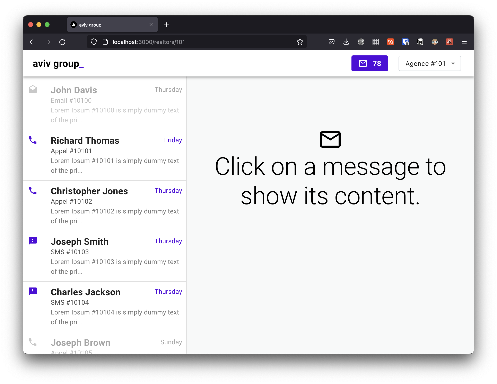
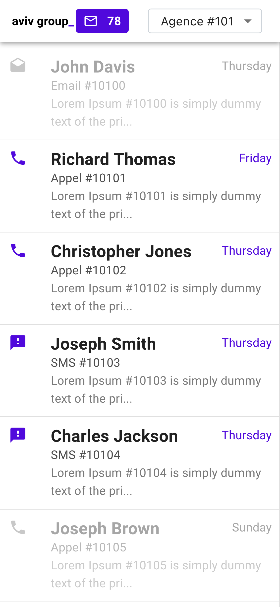

# aviv

| Desktop | Mobile |
|---------|--------|
|  |  |

[Video demo](../screnshots/aviv_demo_1.mp4)

This is an application prototype on a backoffice to view and manages messages from various sources (email, phone, sms).

# 🎉 Features 

Here are the basic features developed for this app:

* View messages of a realtor
* Switch realtor from the top select in the appbar
* Follow unread count
* View message content and details (this will mark it as read)
* Icon button to mark a message as unread
* Responsive → mobile view

# 🚀 Run the app

### Prerequesites:

* [docker](https://docker.com) for the backend API
* [node.js](https://nodejs.org) to start the frontend app

Start the frontend app:

* Clone the repo: `git clone https://github.com/rootasjey/aviv.git`
* Go to the front folder: `cd aviv/front`
* Run the frontend app: `yarn start` or `npm start`

Start the docker image (if not already done):

* Install [docker](https://docker.com)
* Start the image with: `docker run -p 8080:8080 --rm --name MA-FTT-API meilleursagents/frontend-technical-test-api`

Enjoy.

# 🤓 Tech Stack

These tools helped build this app:

* [TypeScript](https://www.typescriptlang.org/) → Main language
* [Next.js](https://nextjs.org) → build frontend
* [mui](https://mui.com) → visual design
* [emotion](https://emotion.sh) → styling
* [dayjs](https://day.js.org) → relative time
* [react-infinite-scroll-hook](https://github.com/onderonur/react-infinite-scroll-hook) → infinite scroll

# 🧪 Testing

There are unit testing done with [`react-testing-library`](https://testing-library.com) and [`jest`](https://jestjs.io), and end to end tests done with [`cypress`](https://cypress.io).

* Unit tests are located in the folder: `__tests___`
* E2E tests are located in the folder: `cypress`

We test component in isolation with `testing-library` and the complete application with `cypress`.

Note that to run `cypress` scenarios, you'll need to start:

* docker image
* frontend app
* cypress

What we test:

* That information are displayed correctly
* Switching agency update the user inface
* Clicking on a message open the details pane
* The unread count correctly updates
* URLs matchs the application's state

There could be an integration test for the `<Layout />` component.